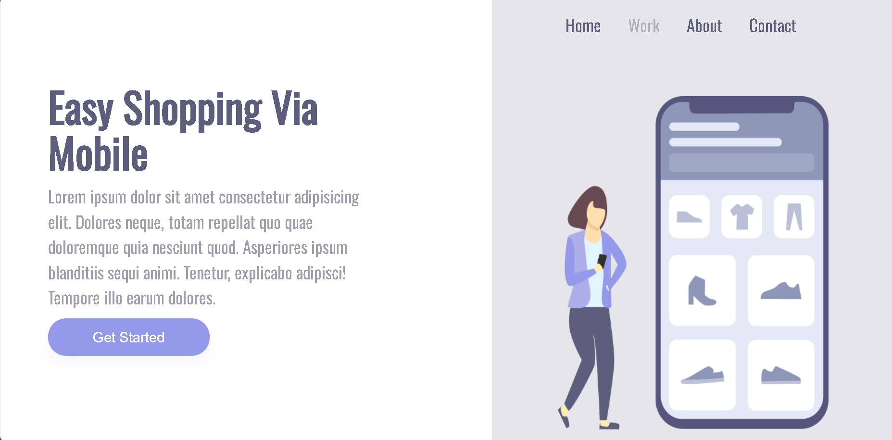
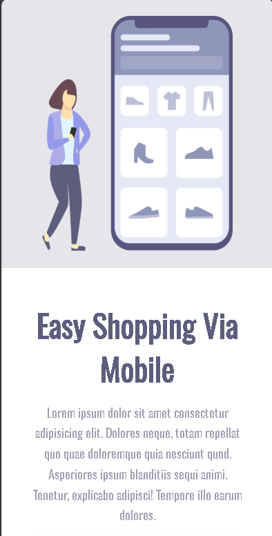

# EasyShopp - Landing Page Responsiva

Este é um projeto de uma landing page responsiva chamada "EasyShopp", desenvolvida como parte de um estudo em desenvolvimento web. A página apresenta um design limpo e moderno, que se adapta a diferentes tamanhos de tela, desde desktops a dispositivos móveis.

## ✨ Funcionalidades

-   **Design Responsivo:** O layout se ajusta perfeitamente a telas de desktop e mobile, graças ao uso de Media Queries.
-   **Layout Moderno:** Utiliza Flexbox para criar uma estrutura de duas colunas em telas maiores, que se transforma em uma única coluna em telas menores.
-   **Fontes Customizadas:** Integra a fonte 'Oswald' do Google Fonts para uma tipografia elegante.
-   **Efeitos de Interação:** Botões e links possuem transições suaves (`:hover`, `:active`) para uma melhor experiência do usuário.

## 🚀 Tecnologias Utilizadas

O projeto foi construído utilizando as seguintes tecnologias:

-   **HTML5:** Para a estrutura semântica da página.
-   **CSS3:** Para estilização, layout e responsividade.

## 🖼️ Visualização

Abaixo estão imagens de como a aplicação se parece em diferentes dispositivos.

*(Dica: Substitua as URLs abaixo pelas imagens do seu projeto)*


*<p align="center">Visualização em Desktop</p>*


*<p align="center">Visualização em Mobile</p>*

## 📂 Estrutura do Projeto

A estrutura de arquivos do projeto é simples e organizada:

```
/
├── index.html       # Arquivo principal da estrutura da página
└── style.css        # Arquivo de estilos
```

## 🔧 Para visualizar acesse:


Aula do curso Fullstack Devclub, executada por &copy;NexusCleo 2025.